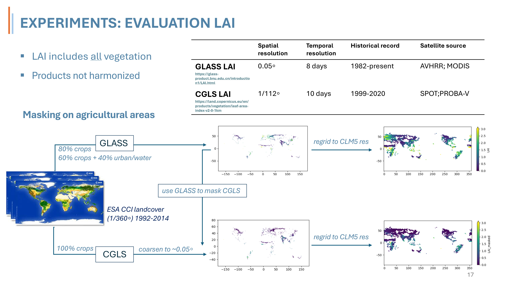

# ctsm_processing_python
python code related to CTSM (v5.2)
Most of the code is postprocessing of CLM5 data or evaluation data (crop yield /LAI)

### postprocessing
contains:

#### functions organized per category:
- LAI_functions.py : functions related to calculation of LAI slope
- HS_functions.py  : functions related to definition of heatwave
- GRAINC_functions.py : CLM postprocessing functions for annual yield
#### notebooks to execute evaluation:
- mask_CGLS_LAI.ipynb:

### remap_lai_agriculture
contains python and bash scripts to harmonize LAI datasets from GLASS and CGLS, extract agricultural information based on CCI landcover data and aggregate to CLM5 desired resolution.
- processing_bash: simple remapping scripts using CDO
- ESA_CCI_cropmask_functions.ipynb: crop masking of GLASS LAI using CCI data
- mask_CGLS_LAI.ipynb: elaborate script masking Copernicus LAI using CCI masks and harmonizing with GLASS LAI.

See workflow in image below

